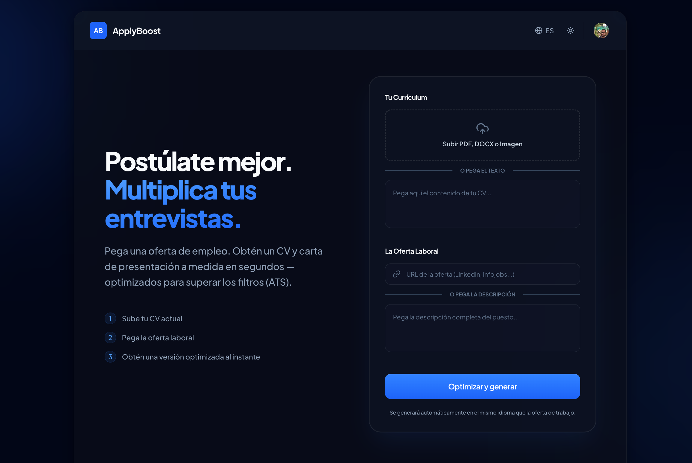
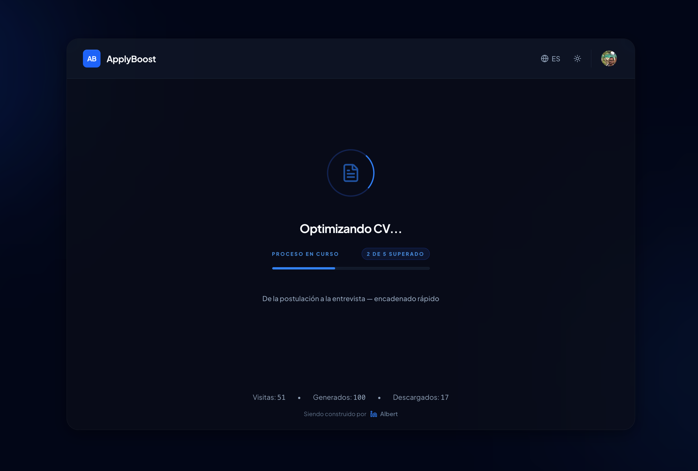
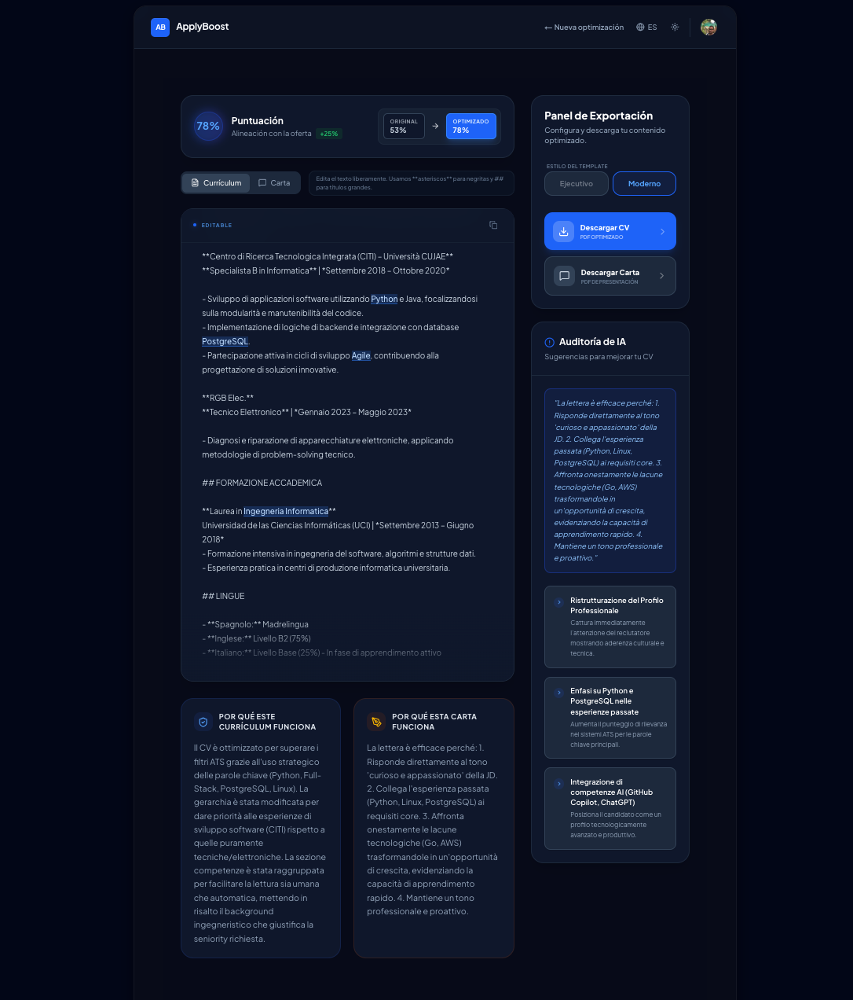

# ApplyBoost

## 1. Descripción

**Convierte ofertas de empleo en CVs y cartas de presentación adaptadas en segundos.**

Aplicar a empleos está roto. Los candidatos envían el mismo CV genérico a todas o adaptan cada una a mano (un proceso lento y agotador). ApplyBoost nace para empoderar al postulante y automatizar ese desgaste. Un input → una candidatura optimizada → lista para enviar.

**¿El problema real?**
Las agencias de reclutamiento ya tienen herramientas avanzadas. El candidato no. 
Las soluciones actuales requieren mucha edición, dependen de que tú sepas hacer *prompts*, rompen los formatos visuales del PDF y alucinan información.

**Nuestra solución:**
ApplyBoost no es un creador de CVs ni un chatbot. Es un **optimizador de candidaturas**.
Integramos todo en un flujo simple, separando la IA (que transforma) del código tradicional (que estructura y da formato) para cero alucinaciones.

1. **Entrada:** CV (PDF/Imagen/Texto) + Oferta laboral (URL o texto).
2. **Procesamiento Resiliente:** 
   * **Fase 1 (Lectura):** OCR nativo multimodal con **Gemini** (visualizando integrar modelos Open Source a futuro para no depender de corporaciones).
   * **Fase 2 (Generación):** Motor en cascada iterativa. Si Gemini falla, entra **Groq**; si falla, delega a **Cerebras**. Máxima disponibilidad.
   * **Scraping Propietario:** Extracción de URLs locales y directas (evitando costos de APIs externas).
3. **Salida Editable:** War-room para previsualizar, exportar PDF limpio e iniciar sesión (OAuth simple) si quieres remover los límites del sistema invitado. El único costo actual es tu autenticación.

## 2. Enlace a la Demo

🔗 **Demo funcional actual:** [https://www.45.90.237.160.sslip.io/](https://www.45.90.237.160.sslip.io/)

*(Nota: El dominio `nic.eu.org` oficial se encuentra pendiente de aprobación. Se provee enlace transitorio al VPS enrutado con SSL)*.

## 3. Capturas y GIFs

### 1. El Wizard de Entrada

### 2. Parseo y Algoritmo en proceso

### 3. War Room (Vista de Edición Frontal)

## 4. Explicación de cómo se ha utilizado CubePath

ApplyBoost utiliza un entorno de producción basado en **Auto-alojamiento (Self-hosting)** sobre un VPS de **CubePath**, lo que permite un control absoluto sobre recursos críticos del sistema, dependencias base de Node y binarios requeridos (como Chromium para Puppeteer en exportación PDF).

### Especificaciones Básicas
* **Proveedor:** CubePath (Plan `gp.micro` alojado en Barcelona, ES).
* **Hardware:** 2 vCPU, 4 GB RAM, 80 GB SSD.
* **Gestión y Orquestación:** Panel **Dokploy** mediante flujos Dockerizados.
* **Red:** Zonas DNS configuradas en el panel de CubePath (`atlas.ns.cubepath.com` y `titan.ns.cubepath.com`).
* **Proxy y Seguridad:** Traefik gestionando balanceo local y SSL con Let's Encrypt.

### Configuraciones Críticas adaptadas al Servidor
Poner este proyecto en producción en el VPS requirió ajustes específicos para garantizar estabilidad bajo estrés de I/O y procesamiento concurrente:
1. **Networking Restringido (Filtro IPv4):** Para asegurar la descarga estable de paquetes y contenedores base en el datacenter, se forzó el uso estricto en el gestor de paquetes (`Acquire::ForceIPv4 "true"`).
2. **Gestión de RAM Quirúrgica:** Next.js 15 devora memoria al compilar el App Router. Como el VPS destina ~2.5GB estables al resto de la pila Docker, configuramos un límite estricto de **1024MB - 1536MB** vía `NODE_OPTIONS` y `webpackMemoryOptimizations` para evitar picos que tiren el servidor (OOM Killer).
3. **Storage & Stand-alone Build:** Optimizamos el Dockerfile para crear un *output stand-alone*, minimizando drásticamente el peso del empaquetado final alojado en el SSD de 80GB, sumado a limpiezas cronometradas (`docker system prune -af`).
