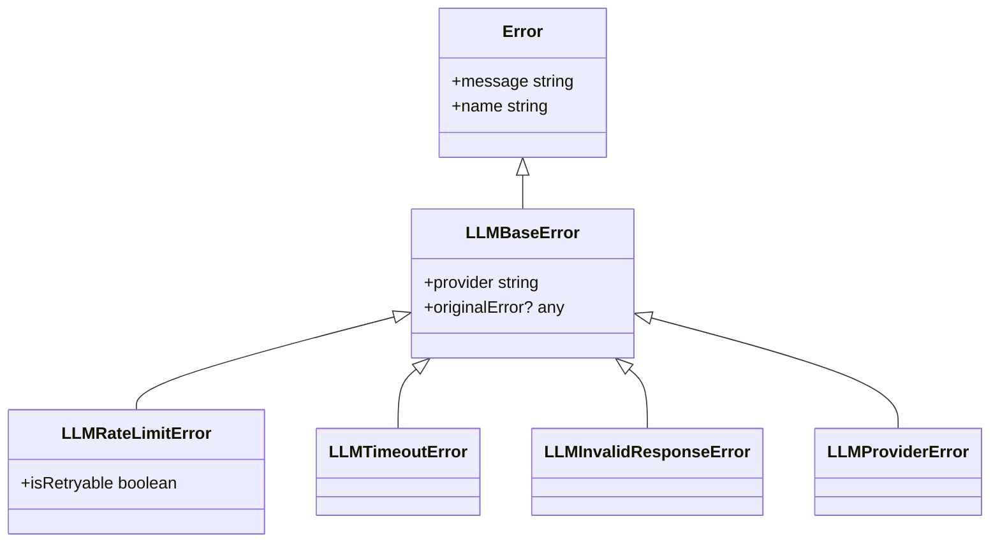

# Design: llm-resilience-and-errors

## 1. Error Hierarchy Implementation

We will replace the simple `Error` usage with a robust hierarchy in `src/lib/llm/types.ts`.

## 2. Stateless Round-Robin Algorithm

The goal is to eliminate `currentProviderIndex` while maintaining load distribution.

### Logic:
1. `providerOrder = getProviderOrder()` (from .env).
2. `startIndex = Math.floor(Math.random() * providerOrder.length)`.
3. Loop from `attempts = 0` to `providerOrder.length`:
   - `index = (startIndex + attempts) % providerOrder.length`.
   - `providerName = providerOrder[index]`.
   - Attempt call...

### Benefits:
- **Stateless**: No shared memory, safe for Vercel/Serverless.
- **Fair Distribution**: Statistical load balancing across all instances.
- **Resilient**: If the first randomized provider fails, it continues the circle.

## 3. Standardized Provider Mapping

Each provider (`GeminiService`, `GroqService`, etc.) will have a common `catch` block (or a utility function) to map native errors to our hierarchy:
- **429/503** -> `LLMRateLimitError`.
- **AbortError/TimeoutError** -> `LLMTimeoutError`.
- **Others** -> `LLMProviderError`.

## 4. Simplified Orchestrator Flow

The `callLLM` function in `index.ts` will be simplified by removing nested try-catches. It will focus on the circular loop and use a helper for the per-provider retry logic.
