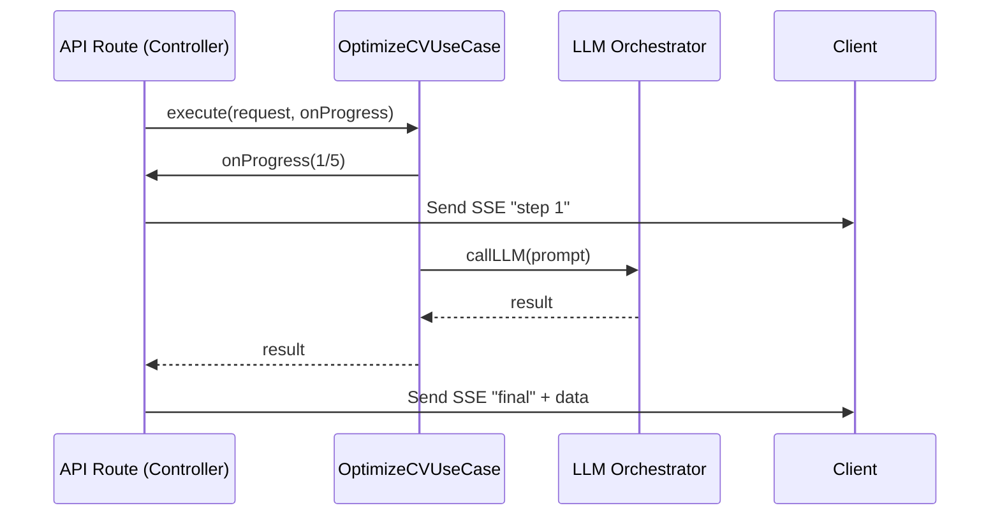

# Design: use-case-architecture (OptimizeCVFlow)

## 1. OptimizeCVUseCase Class

The logic will move from the API route to this clean implementation.

```typescript
export interface OptimizeCVRequest {
  cvFile?: File | null;
  cvText?: string | null;
  jobText?: string | null;
  jobUrl?: string | null;
  outputLanguage: "auto" | "es" | "en" | "it";
  anonymousId?: string | null;
  onProgress?: (step: number, message?: string) => Promise<void>;
}

export class OptimizeCVUseCase {
  async execute(request: OptimizeCVRequest): Promise<GenerateResponse> {
    // 1/5: Auth & Quota check
    // 2/5: CV Parsing (OCR)
    // 3/5: Analysis (Language & Prompt)
    // 4/5: LLM Generation
    // 5/5: Persistence & Finalization
  }
}
```

## 2. Decoupled Streaming Flow

The API route will bridge the Use Case and the Response stream using the `onProgress` callback.



## 3. Benefits of this Design

- **Unit Testability**: We can now test the entire flow without mock requests/formData.
- **Maintainability**: If we change the progress reporting from SSE to WebSockets, the Use Case stays UNTOUCHED.
- **Cleaner API Routes**: The route code will be reduced by 80%.
- **Single Source of Truth**: The business logic is no longer hidden in an infra file.
